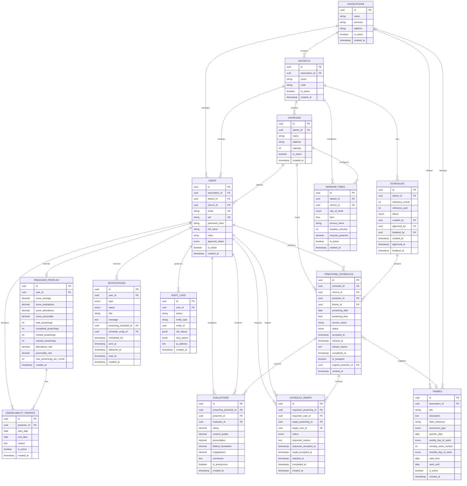
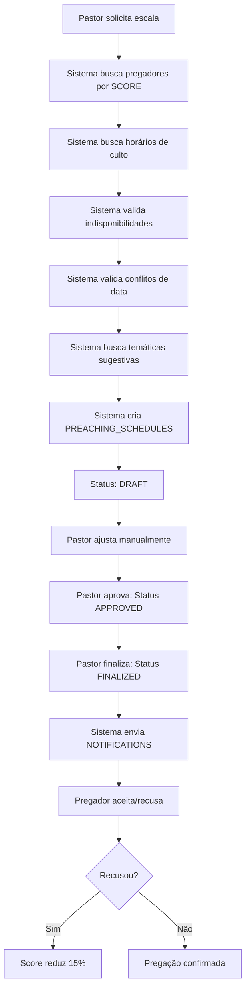
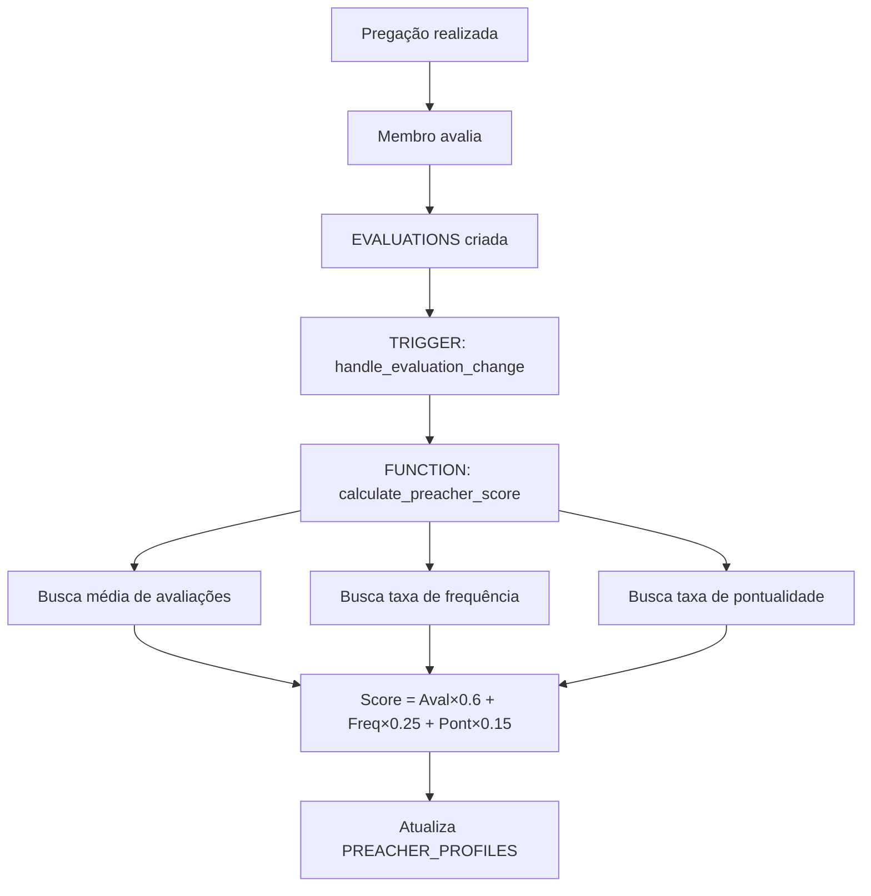
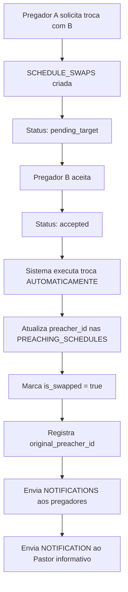

# 📊 DIAGRAMA ENTIDADE-RELACIONAMENTO (ERD)
## Sistema de Gestão de Escalas de Pregação - IASD

---

## 🎨 DIAGRAMA VISUAL (Mermaid)



---

## 🔗 RELACIONAMENTOS PRINCIPAIS

### 1. HIERARQUIA ORGANIZACIONAL

```
ASSOCIATIONS (1) ──── (N) DISTRICTS (1) ──── (N) CHURCHES
       │                      │                      │
       │                      │                      │
       └──────────────────────┴──────────────────────┘
                              │
                        (N) USERS (1:1) (1) PREACHER_PROFILES
```

**Descrição:**
- Uma **Associação** contém vários **Distritos**
- Um **Distrito** contém várias **Igrejas**
- **Usuários** pertencem a Associação/Distrito/Igreja
- **Pregadores** têm perfil estendido com scores

---

### 2. SISTEMA DE ESCALAS

```
DISTRICTS (1) ──── (N) SCHEDULES (1) ──── (N) PREACHING_SCHEDULES
                                                       │
                                                       ├── (N) EVALUATIONS
                                                       └── (N) SCHEDULE_SWAPS
```

**Descrição:**
- Um **Distrito** tem várias **Escalas** (uma por mês)
- Uma **Escala** contém várias **Pregações**
- Cada **Pregação** pode ter várias **Avaliações**
- **Pregações** podem ser trocadas via **Schedule Swaps**

---

### 3. SISTEMA DE TEMÁTICAS

```
ASSOCIATIONS (1) ──── (N) THEMES
                              │
                              │ (sugerido para)
                              │
                       PREACHING_SCHEDULES
```

**Descrição:**
- **Associação** cadastra **Temáticas** (data específica, semanal, mensal)
- **Temáticas** são sugeridas automaticamente nas **Pregações**
- Aplicadas a todas igrejas da associação

---

### 4. SISTEMA DE USUÁRIOS

```
USERS
  ├── roles[] = ['preacher'] ──► PREACHER_PROFILES (score, estatísticas)
  ├── roles[] = ['evaluator'] ──► EVALUATIONS (avalia pregadores)
  ├── roles[] = ['district_pastor'] ──► SCHEDULES (gerencia escalas)
  └── roles[] = ['association_member'] ──► THEMES (cadastra temáticas)
```

**Descrição:**
- Usuários com **múltiplos perfis** simultâneos
- Perfil **Pregador**: tem score, estatísticas, indisponibilidades
- Perfil **Avaliador**: pode avaliar pregações
- Perfil **Pastor Distrital**: gerencia escalas
- Perfil **Membro Associação**: gerencia tudo

---

## 📊 CARDINALIDADES

| Relacionamento | Cardinalidade | Descrição |
|----------------|---------------|-----------|
| **ASSOCIATIONS → DISTRICTS** | 1:N | Uma associação tem vários distritos |
| **DISTRICTS → CHURCHES** | 1:N | Um distrito tem várias igrejas |
| **DISTRICTS → SCHEDULES** | 1:N | Um distrito tem várias escalas (uma por mês) |
| **SCHEDULES → PREACHING_SCHEDULES** | 1:N | Uma escala tem várias pregações |
| **USERS → PREACHER_PROFILES** | 1:1 | Um usuário pregador tem um perfil |
| **PREACHING_SCHEDULES → EVALUATIONS** | 1:N | Uma pregação tem várias avaliações |
| **PREACHING_SCHEDULES → SCHEDULE_SWAPS** | 1:N | Uma pregação pode ter várias trocas |
| **USERS → NOTIFICATIONS** | 1:N | Um usuário recebe várias notificações |
| **USERS → UNAVAILABILITY_PERIODS** | 1:N | Um pregador tem vários períodos indisponíveis |
| **ASSOCIATIONS → THEMES** | 1:N | Uma associação tem várias temáticas |
| **THEMES → PREACHING_SCHEDULES** | 1:N | Uma temática é sugerida em várias pregações |

---

## 🎯 FLUXO DE DADOS PRINCIPAIS

### 1️⃣ GERAÇÃO DE ESCALA



---

### 2️⃣ CÁLCULO DE SCORE



---

### 3️⃣ TROCA AUTOMÁTICA



---

## 🔐 CONSTRAINTS E VALIDAÇÕES

### ✅ Unique Constraints (Unicidade)

| Tabela | Campos | Descrição |
|--------|--------|-----------|
| **USERS** | email | Um email por usuário |
| **USERS** | cpf | Um CPF por usuário |
| **PREACHER_PROFILES** | user_id | Um perfil por usuário |
| **SCHEDULES** | district_id + month + year | Uma escala por distrito por mês |
| **EVALUATIONS** | preaching_schedule_id + evaluator_id | Uma avaliação por avaliador por pregação |
| **SETTINGS** | scope + key | Uma configuração por escopo e chave |

---

### ✅ Check Constraints (Validações)

| Tabela | Campo | Validação |
|--------|-------|-----------|
| **PREACHER_PROFILES** | score_average | >= 0 AND <= 5 |
| **EVALUATIONS** | rating | >= 0 AND <= 5 |
| **SCHEDULES** | reference_month | BETWEEN 1 AND 12 |
| **SCHEDULES** | reference_year | >= 2024 |
| **UNAVAILABILITY_PERIODS** | dates | end_date >= start_date |
| **WORSHIP_TIMES** | scope | (district_id IS NOT NULL XOR church_id IS NOT NULL) |
| **THEMES** | recurrence | Validação por tipo de recorrência |

---

### ✅ Foreign Key Constraints (Integridade Referencial)

**Total:** 32 Foreign Keys

**Principais:**
- `users.association_id → associations.id`
- `users.district_id → districts.id`
- `users.church_id → churches.id`
- `preacher_profiles.user_id → users.id`
- `schedules.district_id → districts.id`
- `preaching_schedules.schedule_id → schedules.id`
- `preaching_schedules.preacher_id → users.id`
- `evaluations.preacher_id → users.id`
- `evaluations.evaluator_id → users.id`

**ON DELETE Policies:**
- `CASCADE` - Deleta registros dependentes (ex: district → churches)
- `SET NULL` - Anula referência (ex: deleted user → created_by)

---

## 📈 ÍNDICES PARA PERFORMANCE

### 🔥 Índices Críticos

```sql
-- Busca de usuários
CREATE INDEX idx_users_email ON users(email);
CREATE INDEX idx_users_cpf ON users(cpf);

-- Geração de escalas (ORDER BY score)
CREATE INDEX idx_preacher_score ON preacher_profiles(score_average DESC);

-- Validação de conflitos
CREATE INDEX idx_preaching_date_preacher ON preaching_schedules(preaching_date, preacher_id);

-- Busca de escalas
CREATE INDEX idx_schedules_reference ON schedules(reference_year DESC, reference_month DESC);

-- Notificações agendadas
CREATE INDEX idx_notifications_scheduled ON notifications(scheduled_for) WHERE scheduled_for IS NOT NULL;

-- Array de roles
CREATE INDEX idx_users_roles ON users USING GIN(roles);
```

---

## 🔄 TRIGGERS AUTOMÁTICOS

### 1. update_updated_at_column
**Tabelas:** Todas
**Ação:** Atualiza `updated_at` automaticamente em UPDATE

### 2. handle_preaching_refusal
**Tabela:** preaching_schedules
**Quando:** UPDATE status → 'refused'
**Ação:**
- Reduz score em 15%
- Atualiza estatísticas

### 3. handle_evaluation_change
**Tabela:** evaluations
**Quando:** INSERT ou UPDATE
**Ação:**
- Recalcula score do pregador
- Atualiza preacher_profiles

---

## 📊 VIEWS MATERIALIZADAS (Futuro)

### Sugestões para Fase 2

```sql
-- Performance em relatórios
CREATE MATERIALIZED VIEW mv_district_statistics AS
SELECT
    d.id as district_id,
    d.name as district_name,
    COUNT(DISTINCT c.id) as total_churches,
    COUNT(DISTINCT u.id) as total_preachers,
    AVG(pp.score_average) as avg_score,
    COUNT(ps.id) as total_preachings_month
FROM districts d
LEFT JOIN churches c ON c.district_id = d.id
LEFT JOIN users u ON u.district_id = d.id AND 'preacher' = ANY(u.roles)
LEFT JOIN preacher_profiles pp ON pp.user_id = u.id
LEFT JOIN preaching_schedules ps ON ps.preacher_id = u.id
    AND ps.preaching_date >= date_trunc('month', CURRENT_DATE)
GROUP BY d.id, d.name;
```

---

## 🎨 LEGENDA DE CORES (Diagrama)

| Cor | Categoria | Descrição |
|-----|-----------|-----------|
| 🔵 Azul | Organizacional | associations, districts, churches |
| 🟢 Verde | Usuários | users, preacher_profiles |
| 🟡 Amarelo | Escalas | schedules, preaching_schedules |
| 🟠 Laranja | Avaliações | evaluations, schedule_swaps |
| 🔴 Vermelho | Suporte | themes, worship_times, notifications |
| ⚫ Preto | Sistema | audit_logs, settings, import_logs |

---

## ✅ CHECKLIST DE INTEGRIDADE

- [x] Todos relacionamentos definidos
- [x] Foreign Keys com políticas corretas
- [x] Unique Constraints implementados
- [x] Check Constraints implementados
- [x] Índices em todas Foreign Keys
- [x] Índices em campos de busca frequente
- [x] Triggers para automação
- [x] Funções para cálculos complexos
- [x] Views para queries recorrentes
- [x] Soft delete em tabelas principais
- [x] Auditoria de ações críticas

---

## 📚 PRÓXIMOS PASSOS

1. **Aprovação do Schema** ⏳
2. **Criação do Banco de Dados**
3. **Implementação do Backend (FastAPI)**
4. **Implementação do Frontend (React)**
5. **Implementação do Mobile (React Native)**
6. **Testes e Validação**
7. **Deploy e Produção**

---

**Versão:** 1.0
**Data:** 2025-11-21
**Status:** ⏳ Aguardando Aprovação
